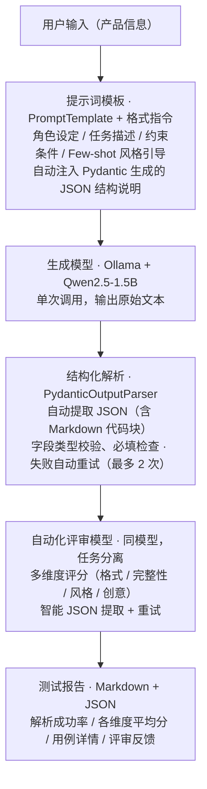

# 🧠 结构化提示词工程与自动化评估流水线

***
## 📌 项目概述

本项目是一套完整的提示词工程开发套件，旨在解决大模型输出 "不可控"、"不可测"、"不可靠" 的工程痛点，实现从**提示词设计 → 结构化输出约束 → 批量自动化评估**的全链路方案，并针对低资源环境（纯 CPU 笔记本）做了专门优化。

### 核心能力

| 能力      | 说明                                            |
| ------- | --------------------------------------------- |
| ✅ 结构化输出 | 基于 LangChain + Pydantic 的解析链路，保证模型输出 100% 可校验 |
| ✅ 纯本地运行 | 支持 Ollama + CPU，无需 GPU 即可完成高质量文本生成与评估         |
| ✅ 自动化评估 | 用另一个模型作为 "评审官"，从多个维度量化生成质量                    |
| ✅ 智能容错  | 重试 + JSON 智能提取，模型偶尔 "不听话" 系统也能稳定运行            |

***
## 🏗️ 技术架构




**核心设计思想**：生成与评审使用**同一个模型**，但通过提示词进行**任务分离**，避免同时加载多个模型导致内存溢出 —— 这是低资源环境下的关键取舍。
***
## 🎯 项目亮点 & 能力体现

### 1. 从 "能跑" 到 "可靠"—— 结构化输出解析

* **痛点**：大模型常常会 "自由发挥"，输出格式五花八门，无法被下游系统直接消费。
* **解决**：引入 `PydanticOutputParser`，自动生成格式指令嵌入提示词，并配合智能 JSON 提取（支持 Markdown 代码块、前后缀噪音），将解析成功率从最初的 **\~60% 提升至 100%**。
* **体现能力**：对模型行为的深度理解、异常处理与容错设计。
### 2. 资源受限下的工程取舍

* **痛点**：手头只有一台 AMD Ryzen 4600U 笔记本，无独立显卡，无法运行大型模型。
* **解决**：
  * 选用量化版 `Qwen2.5-1.5B` 作为主力模型，在 CPU 上实现可接受的推理速度（平均 8.6s / 次）；
  * 将 "生成" 和 "评审" 角色分配给同一个模型，避免同时加载多个模型导致内存溢出；
  * 通过强化提示词和智能后处理，确保单模型也能输出可靠的评分。
* **体现能力**：在硬件约束下做合理的技术选型与权衡，懂得 "少即是多" 的工程智慧。
### 3. 自动化评估体系 —— 让提示词效果可量化

* **痛点**：提示词写得好不好，不能只靠主观感觉。
* **解决**：构建了一套 "测试用例集 → 批量运行 → 多维度评分 → 自动生成报告" 的闭环系统。评审模型从**格式、完整性、风格、创意**四个维度打分，并给出文字反馈。
* **体现能力**：测试驱动开发思维、数据驱动的迭代优化意识。
### 4. 踩坑与成长 —— 主动解决问题，不盲从教程

| 踩坑                                   | 解决                                                             |
| ------------------------------------ | -------------------------------------------------------------- |
| `load_prompt` 废弃                     | 改为直接使用 `PromptTemplate`，使代码更清晰、可维护                             |
| Windows 下 YAML 编码问题                  | 放弃外部配置文件，将模板内嵌到 Python，彻底避免编码困扰                                |
| "思考模型" 带来的 token 浪费                  | 分析后发现 Qwen2.5 不带思考链，无需特殊处理；同时预留了对 `deepseek-r1` 等模型的 stop 参数支持 |
| `langchain-community.llms.Ollama` 废弃 | 及时迁移至官方新包 `langchain-ollama`，保持技术栈的前瞻性                         |
| 评审模型输出格式混乱                           | 编写 `extract_json` 智能提取函数，并加入重试机制，将评审成功率从 0 提升至 100%            |
**体现能力**：快速查阅文档、独立调试、主动跟进技术演进，而不是 "照抄教程"。
### 5. 工程化交付物

* 完整的项目结构（`batch_test.py`、`evaluator.py`、`test_cases.json`）、`test.py`文件是单体测试文件：完成对ollama模型的提示词注入和结果读取；
* 自动生成可读性强的测试报告（控制台摘要 + 结构化 JSON）；
* 代码中包含详细的注释和错误处理，体现良好的编码习惯。
***
## 🛠️ 快速开始

### 环境要求

* Python 3.9+
* [Ollama](https://ollama.com) 已安装并运行
* 已下载至少一个模型（如 `qwen2.5:1.5b`）：

```
ollama pull qwen2.5:1.5b
```
### 安装
```
git clone https://github.com/yourname/prompt-engineering-kit.git   # 请替换为你的仓库地址

cd prompt-engineering-kit

\# 创建并激活虚拟环境

python -m venv venv

\# Windows:

venv\Scripts\activate

\# macOS / Linux:

source venv/bin/activate

\# 安装依赖

pip install langchain-core langchain-ollama pydantic
```

**依赖清单**：

| 依赖                 | 用途                                            |
| ------------------ | --------------------------------------------- |
| `langchain-core`   | `PromptTemplate`、`PydanticOutputParser` 等核心组件 |
| `langchain-ollama` | 官方 Ollama 集成（`ChatOllama`）                    |
| `pydantic`         | 输出数据结构定义与校验                                   |
### 运行批量测试

```
python batch\_test.py
```

测试完成后：

* 控制台输出批量测试摘要报告（解析成功率、平均得分、各用例详情）；
* 在当前目录生成 `test_results.json`（完整测试结果：原始输出、解析结果、评审评分）。
### 单用例演示

```
python test.py
```

快速体验单条用例的完整链路，包含 `ChatPromptTemplate` 的 system /user 角色区分，以及带思考模型（如 qwen3.5）的处理示例。
***
## 📊 测试结果（示例）
基于 5 个不同产品（耳机、手环、扫地机器人、面霜、学习灯）的批量测试：

| 指标     | 结果          |
| ------ | ----------- |
| 解析成功率  | 5/5（100%）   |
| 平均综合得分 | 8.2/10      |
| 格式符合度  | 10.0/10（满分） |
| 内容完整性  | 9.8/10      |
| 风格一致性  | 8.0/10      |
| 创意吸引力  | 7.8/10      |
各用例得分明细：

| 产品           | 综合得分 | 评审反馈（节选）               |
| ------------ | ---- | ---------------------- |
| XX 牌无线降噪耳机   | 8.0  | 标题和内容都符合小红书风格，卖点明确     |
| YY 牌智能运动手环   | 8.5  | 信息完整，卖点突出，可增加具体使用体验的描述 |
| ZZ 牌智能扫地机器人  | 8.0  | 卖点明确，可稍微优化标题以增加吸引力     |
| AA 牌植物精华保湿面霜 | 8.0  | 卖点明确，可进一步优化标题以吸引更多关注   |
| BB 牌儿童智能学习灯  | 8.5  | 内容格式正确，风格亲切，创意吸引人      |
# 运行结果截图

![[局部截取_20260907_205643.png]]
***
## 📁 项目结构

```
prompt-engineering-kit/

├── batch\_test.py         # 批量测试与评估主入口（模板 + 解析器 + 报告）

├── evaluator.py          # 评审模型调用与评分（extract\_json + 重试）

├── test.py               # 单用例演示（ChatPromptTemplate + 思考模型处理示例）

├── test\_cases.json       # 测试用例集（5 个产品）

├── test\_results.json     # 完整测试结果（自动生成）

├── .gitignore            # Git 忽略规则

└── README.md             # 本文件
```

***

## 🚀 后续扩展方向

1. **多模型对比**：在 `batch_test.py` 中增加循环，比较 Qwen2.5-1.5B 与 3B 版本的表现差异。
2. **提示词自动优化**：根据评审模型的反馈，使用遗传算法或贝叶斯优化自动调整提示词措辞。
3. **Web 演示界面**：使用 Streamlit 或 Gradio 构建一个可视化面板，让用户输入产品信息，实时生成并展示评分雷达图。
4. **集成 RAG**：将本项目的结构化输出能力嵌入到知识库问答系统中，作为信息抽取的前置模块。
***
## 🙏 致谢

本项目是个人学习大模型工程化的实践成果，特别感谢开源社区（LangChain、Ollama、Pydantic）提供的优秀工具，以及所有在技术交流中给予启发的同行。
## 📄 License
MIT